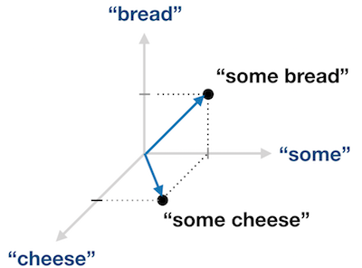
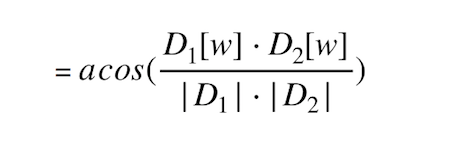
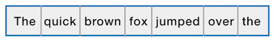
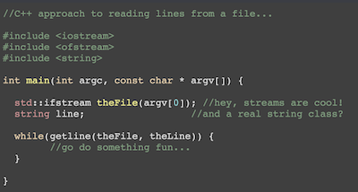

# Assignment1
Due: Jan 30, 11:15p (PST)

## Preface

Welcome to ECE180!  We’re really excited that you’ve decided to join us for our inaugural voyage.  We sure hope you have as much fun taking this class as we’re having developing it!  Naturally, we want you to really grow in the areas of software development and C++.  

### On Writing Code

You’re going to be writing and debugging lots of code in this class. In nearly every case, we have two objectives in mind:
1. To give you experience with the many new idioms in Object-oriented development with C++
2. To help you to learn to think like a software developer. 

As important as learning the C++ language may be, we believe that it’s even more important that you learn the conceptual language of software design.  How you think about the problems you’ll face is often the most important factor in whether you can craft a software solution.  

Take time to reflect on these assignments, and consider the larger concepts — before you start writing any code.  Remember that a fundamental advantage of object-oriented programming is that these techniques allow us to more easily reason about the problem space.  So, take some time to consider the relationships between key elements in the problem space, and how you might synthesize them into a working model.  During this phase, it’s a great idea to chat with peers and instructors on concepts you’re working through. Software design is a team sport.

### An Aside About Writing C++ Code

You may be wondering how we can expect you to write C++ classes and methods, given that we haven't taught you how to do that just yet. Fortunately for you, in this assignment, we're provided a set of C++ classes that handle the overall process for you. Most of the code you write will be fairy traditional C-oriented code. The one exception is that you may choose to use some of the powerful collection classes provided by the Standard Template Library (STL). In that case, you'll find that the syntax and usage patterns for the STL can be found and understood in very little time. There are hundreds of great resources on the web (and in your book) on this topic. 

In case you haven't discovered it already, [stackoverflow](https://www.stackoverflow.com) is a fantastic resource for learning and solving small programming-related issues. 


## Overview

In this assignment you will be reading data from files, processing and storing the file contents, processing and comparing the contents, and writing the results back to output files.  If you worked for a bank, this standard input-output process would be referred to by the acronym ETL (Extract, Transform, Load).  ETL may be the most common process patterns you’ll see.
The file reading component for this assignment will be rather mundane, apart from the fact that we’ll be using C++ streams. It’s the analysis and tranformational part of this assignment that is interesting. 

### Measuring Similarity Between Documents

Plagiarism is a rampant issue, in the arts, education, and even in politics. In order to thwart plagiarism, many techniques have been developed and tried. CRC32 computes a numeric fingerprint for a document; cool but not what we need.  In this assignment we’ll use a technique called, “document distance”, which uses a vector-based “distance” function.  This method can be used to determine the proximity of documents in vector-space. If the distance is 0, it suggests that the documents are identical, and you’ve caught someone trying to cheat.



Let’s define a “document” as a collection of words, similar to this document. Words comprise the collection of letter+number sequences, separated by whitespace or other punctuation. We can describe the collection of words (w) in a document (D) by using a vector, where D[w] = number of occurrences of w in D. See diagram above for a visualization of two vectors (“some bread” vs “some cheese”).  Since we’ve mapped words in our documents into vector-space, it’s trivial to compute a distance using the dot-product. By that method, we can formulate a simple equation to measure the distance as:



If the resulting angle of all this is 0, then the documents are equal. If the angle is 90 degrees, the documents are completely different.  Advances in document processing are relatively new; many of these algorithms have been developed in the last 30 years or so. 

### Assembling a list of bi-grams

Imagine that we were to transcribe all the words in a document on to a piece of tape in sequential order. It would look something like this:



Bi-grams are word-pairs. The bi-grams in a sentence is the set of word-pairs we encounter as we iterate the sentence in reading order (left-to-right in English). In our example, the first three word-pairs are:  “The quick”, “quick brown”, “brown fox”, and so on. 

### A Quick Word on JSON

In part 2 of your assignment, you are expected to generate a json formatted text file. JSON is a lightweight text-based data interchange format derived from javascript.  JSON files contain a set of key-value pairs, making it an natural format for encoding collections of key-value pairs. For example, I can encode the list of my favorite types of fruit into json like this:

```
{
    "fruit": "Apple",
    "size": "Large",
    "color": "Red"
}
```

You’ll discover that json files make it just as easy to encode hierarchical data collections as well.  You can learn more about JSON here:

https://developer.mozilla.org/en-US/docs/Learn/JavaScript/Objects/JSON 

http://www.json.org

## Implementing Your Solution

To properly complete this assignment, your program needs to do the following:

#### PART1
1. Read each of three word-files and extract the words; discarding numnbers, alpha-numeric words, and punctuation
2. Remove “stop words” (black-listed words), that may be found in the stopwords.txt file
3. Determine the number times each word, regardless of case, appears in the document
4. Compute the dot-product
5. Output the results (shown below)

### Saving results for Part1

In order to complete Part1 of this assignment, your code will need to generate multiple files:
1. A output file ("output1.txt") for "words1.txt", containing a comma-separated list of words found in that file
2. A output file ("output2.txt") for "words2.txt", containing a comma-separated list of words found in that file
3. A output file ("output3.txt") for "words3.txt", containing a comma-separated list of words found in that file
4. A 3-line summary file (called results.txt) that contains the result of your analysis.  The summary format is:

Distance A*B:  N   (where N is the resulting dot-product you computed between A and B)
Distance A*C:  N   (where N is the resulting dot-product you computed between A and C)
Document A is most similar to document _X_  (where X is the name of the nearest doc [A or B])

**Note**: Your code will rely on external resource files for input:
1. word-files (3)
2. stop-word file (1)

These files are available under the ./content folder of your assignment folder. Your code will need to specify the correct path to get these files. If you look at main.cpp, there is a variable (`const char *theProjectPath`) which you must set to point to the folder on your drive where the assignment code lives. This path is provided to your controller classes, and is available for you to use in your when specifying input file paths.

#### PART2
1. Assemble bi-grams for all words in each of the three word-files
2. Determine the statistical likelihood that any bi-gram will occur in that document
3. For each word-file your read, generate a json-formatted output file (bigrams1.json, bigrams2.json, bigrams3.json) that contains a list of bi-grams and their statistical likelihood 

The json format of the bi-gram output file is:

```
{
    {"bigram" : "aaa-bbb", "probability" : p1},
    {"bigram" : "bbb-ccc", "probability" : p2},
    {"bigram" : "ccc-ddd", "probability" : p3},    
}
```

You’ll be grateful to know that we’ve already built a simple C++ framework for you. All you have to do is flesh out the key portions of your algorithms. As our goal is to learn to write better code in C++, it’s time to move on to the implementation. 

### Reading files in C++

As we’ve discussed in class, reading files in C++ is typically done using streams; more specifically, a form of stream designed to read input from your OS file system.  You might recall our simple C++ example from lecture where we showed you the basics for reading lines from an input filestream:




### Extracting words

Assuming you can consume (read) the contents of a file stream as a sequence of “lines of text”, your next step is to separate each line into a composite list of words.  That process generally relies on parsing algorithms. Parsing algorithms offer a multitude of ways to breaks character strings into lexical elements according to policy you provide. 

Like most languages, standard C++ libraries exist to make short work of this problem.  Now’s a good time to discover the many C++ resources you have (your book, the google, other programmers, etc.) to learn how to use these libraries in your own code. It is not recommended that you build your own algorithms for parsing text strings into words. Still, if you do so, make sure you build a robust and fast solution.

As you search to discover some of the many tools C++ offers for you to do this, you’re left with an obvious question. What data structure (or class) should you use to describe each word? What structure (or class) should you use to manage the collection of words you’ve just read?  Here’s another really important question: what comes first — the algorithm or the data structure?  Give this some thought as we will discuss topic in future lectures.  


### Pre-processing words
 
As you build your word-list, you code must perform two transformations:  case-normalization and stop-word removal.  Case-normalization is the fancy way of saying that you words all be converted to lower-case.  

“Stop-words” are words that should be eliminated from the input set.  You can find a list of stop words in a file called "stopwords.txt" in your assignment/content folder.  This file contains a list of comma-separated words. Any word contained in the word-list file should be removed from your word-list collections before proceeding with the remaining steps in this assignment. Before proceding, try to think of various ways you can remove stop words from your dataset in a time-efficient manner.

### Counting words

Ahh — you’ve consumed your files, you’ve chosen one data structure to store each word, and another structure to store your word-collections. A C programmer might choose a simple data structure to collect words — perhaps a linked-list.  That’s a fine choice — but it leaves the problem of counting duplicate words up to you. 

Experienced C++ programmers would choose a collection class from the Standard Template Library (STL) that offers the ability to store and count elements automatically.  This is a topic we will explore in great detail in future lectures. Necessity, being the mother of invention, dictates that for this assignment, you must discover the options on your own. Again, you’re free to access the google, your books, and your peers for alternatives. Programming mastery comes after you develop the habit of considering options/implications, rather than accepting practical advice on good faith.

### Building bi-gram pairs 

In our second major task, we are once again we’re aiming to build an internal collection for each of our input files. The collection will store bi-grams present in the input file. This task is predicated on your ability to iterate our underlying collection of words.  A typical data structure course would have you start by choosing a structure that best fits the problem at hand.  Nothing wrong with that approach, and if you’re satisfied with that, so be it. As this is not a typical course, perhaps you'll consider devising a generalizable process that solves the problem of assembling bi-grams and computing bi-gram frequencies without an additional data structure. It's up to you.

### Computing the dot-product

So you’ve consumed three documents, read and parsed each line into words, stored the words in a collection class, counted the frequency of each word in the associated collection, and generated a set of bi-grams.  Good job!  Have a cookie. Then, it’s time to write the code to compute the dot-product for your document pairs. To do so, you may refer to the distance formula (given above). If you’re stuck, it’s time to try the google, your books, and your peers for further insight.  

## Assignment Starter Code

### Getting Assignments from Github

#### What is Github?
Github is a SaaS product/website where teams can manage and share source-code repositories. Github uses the git source-code management tools. Each of your assignments is stored on github. Using github follows a common set of steps:

1. "fork" each assignment repository; a copy of the respository will be downloaded onto your computer
2. work on the assignment, adding/editing sources files to meet assignment requirements
3. submit your completed changes back to github using the git tools

Most of you will have used this process may times by now. If you have never used this process, there are many excellent tutorials on getting started with git (tools) and github (website).

To learn more about github: https://guides.github.com/activities/hello-world/

To learn more about git: https://www.atlassian.com/git/tutorials, and https://try.github.io/levels/1/challenges/1

#### Getting Assignments
When new assignments become available, we will publish a link to them on piazza.  We will also make a reference to the assignment in your lecture slides. 

### Overview
After you get your code from github, take a look inside the assignment folder. You'll find the following items:
1. main.cpp
2. ProcessController.*
3. FileProcessor.*
4. GradingHarness.*
5. makefile

Naturally, main.cpp contains your main function, where processing for this application begins.  The makefile was tested to work on macos (unix). You may need to tweak it slightly to work on Windows, as it hasn't been tested there yet. Actual assignment grading will be run on Linux/Ubuntu.  Let's move on to other more interesting classes. 

#### ProcessController
This class is the top-most controller for this process. It sets up and drives the rest of the processing you'll need to do to complete this assignment. The two most important functions are:

```
  ProcessController& runActual();
  ProcessController& runTests();
```

`runActual` is the method that drives the primary process you'll implement to complete this assignment.  This method is complete, and shouldn't require changes. `runTests` is a placeholder function where you can add test-cases to ensure your code is working. 

The `runActual` method calls two additional methods on the ProcessController class:
```
  ProcessController& processWordFiles();
  ProcessController& saveSummary(const FileProcessor &f1, const FileProcessor &f2, const FileProcessor &f3);
```

These methods setup multiple instances of the FileProcessor class, which do the real work in this assignment. It's worth taking a look at how these are setup. You might find it interesting how ProcessController manages process control.  You will probably not need to make any changes to these methods.  However, you may want to follow a similar pattern in the FileProcessor class, to handle the various tasks required by this assignment. 

#### FileProcessor
This class is where you'll write code to complete the tasks in this assignment. This file is mostly empty, waiting for your code. As the `ProcessController` runs, it will call `FileProcessor::run()` where your code is expected to take over.  If you haven't written object-oriented code before, this may seem confusing at first. Don't worry. It's easier that it may seem, and we'll cover objects and patterns in great detail this term. 

#### GradingHarness
The `GradingHarness` class is here as an example, but you may feel free to ignore it. It's part of the framework we use to enable Vlad-the-Compiler to autograde your assignments.  Please don't make changes to this file. 


## Testing

**Lousy** programmers never test their code. Instead, they just change jobs -- a lot. **Good** programmers test their code after they’ve finished writing it.  But **great** programmers write tests before they write code to solve problems. They try to dream up ways to break their own code, and to prove to themselves that the code has flaws.  

The starter framework for your code contains a testing harness. That harness includes a method called “runtests”. As you develop test functions for your own code, you can add them to the “runtests” method in the harness. As the harness runs, your tests will be called automatically, and output from your tests will be captured in an output file called "testoutput.txt".  For now, it’s up to you to decide how to use this facility — just recognize that writing self-tests for your code is an essential step in learning to improve your software skills.  Also note: you’ll lose points on this assignment if our auto-grading robot (Vlad-the-compiler) discovers that your testing output file is empty. 

## Code Style Guide

This isn’t your first class on software or programming, and you’re probably wondering how we expect your code to be structured and formatted.  From the perspective of our auto-grader, structure and format are completely irrelevant. However, your instructors also will be viewing your code as well, so you would be wise to adhere to a few rules of thumb. 

### Format and Clarity

Your code should be formatted to be easily readable by anyone with more than 1 year of programming experience.  Here are some guidelines for things that matter:

- Avoid dense and complicated code
- Be consistent!  Choose a coding standard for yourself and stick with it
- Partition your logic into class methods as needed to maintain clarity
- Document your code with comments that clearly indicate what you’re doing at a high level

Unsure if you’ve got it right?  Take a look at sample code in your textbook. Look at C++ code examples from github. Ask a friend to take a look. Most of all, use your judgement to estimate whether others can make sense of what you’re doing.  We’re being intentionally vague, so you get to learn what works and what doesn’t. 

## Submitting Your Work

You’ll recall that your work is due by 11:15pm (PST).  We strongly recommend that you aim for 6p (PST) as to avoid the last minute mishaps that frequently occur when panic related to an impending deliverable begins, and we all tend to make silly mistakes.  

As we’ve said in lecture, you will turn your work in using github. Github is an online code repository.  Managing code can be very confusing, but github makes the process fairly easy. And the way we’re going to handle code in this class is even simpler still.  More on that later.

With that said, please understand that when you submit your work via github, your changes are automatically timestamped. Meta data in the code repository makes it plainly obvious to humans and computers alike when your submission arrived.  This is worth mentioning, because the github timestamps on your submissions will be used to to arbitrate whether you turned your work in on time or not. 

Your homework will usually be auto-graded by “Vlad the Compiler” — otherwise known as our software-based auto-grader.  Vlad can be a bit harsh when it comes to scoring homework (see the syllabus), but he does have a somewhat casual relationship with deadlines.  During Grad-school, Vlad often spent spring-break in Cabo-San-Lucas where he learned to enjoy siestas.  Most nights, Vlad awakens from his last-afternoon siesta around midnight, to begin the process of grading your assignments. In other words, you can generally count on a 45 minute grace period for turning in your work. We strongly suggest that you do not try his patience.

## Caveats and Warnings

When you work on your assignments, many of you will create an IDE-based project. IDE’s will likely speed up your process, and give you additional tools, like an integrated debugger. 

It is important to note that Vlad-the-Compiler doesn’t use IDE projects. He uses makefiles to test and grade your homework.  Each of your assignments will include a makefile for this purpose. We strongly recommend that before you turn in your assignments, you attempt to build and run your code using this makefile.  

The files we provide for you by default in your assignment project folders will compile with the given makefile. They just won’t do much, until you add your own code to the solution. In general, you can feel free to change the files we provide you, and to add new files as necessary to solve the assigned problems. Note, however, that some of the files we provide for you have portions that are marked "DO NOT CHANGE".  We ask that you follow that advice carefully.

NOTE: It is **YOUR RESPONSIBILITY** to ensure your solution can be built correctly by the **make** command.

